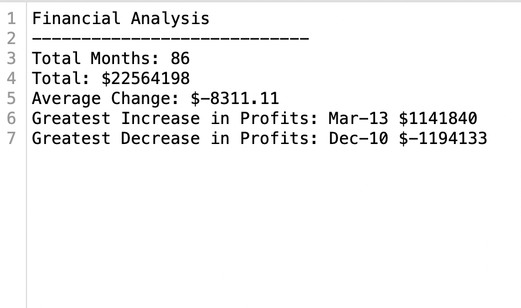
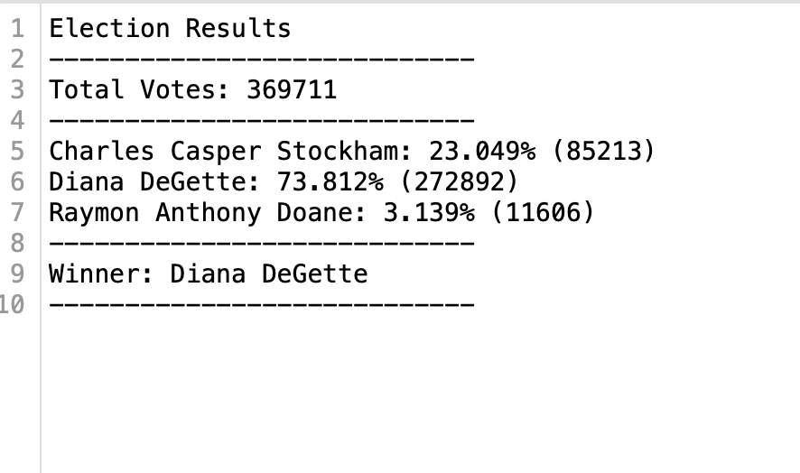
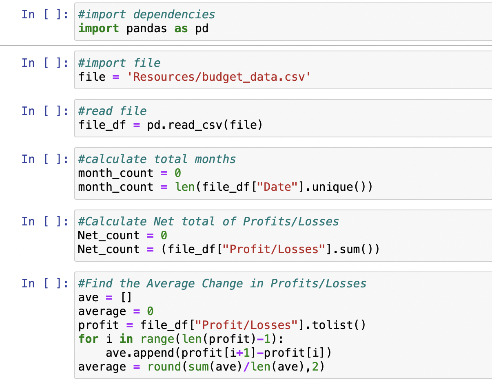
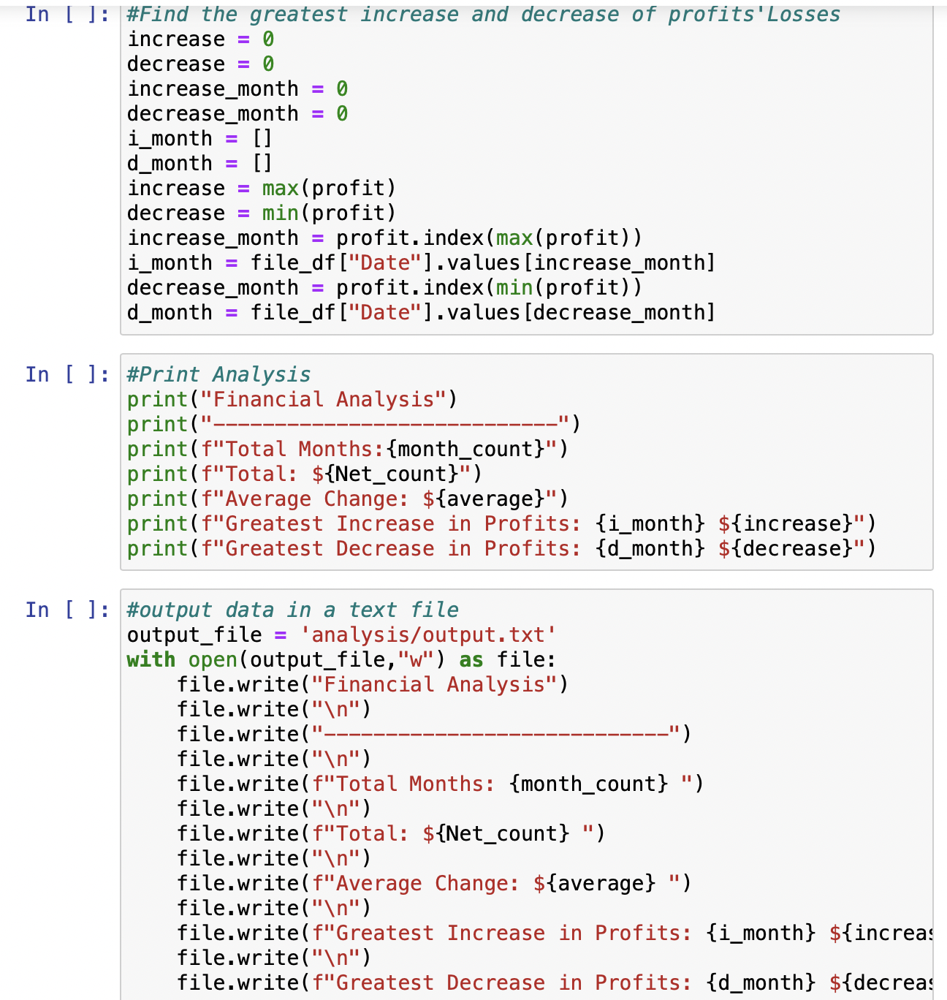
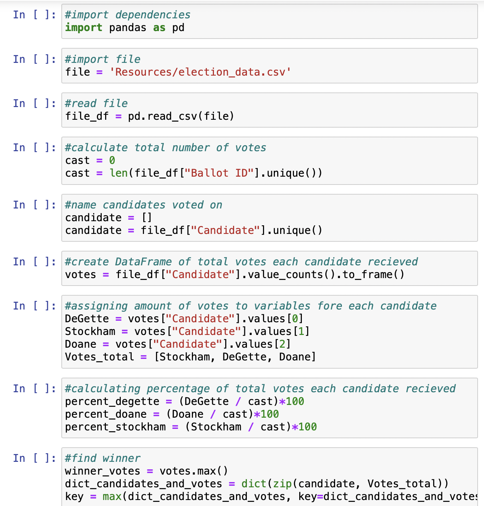
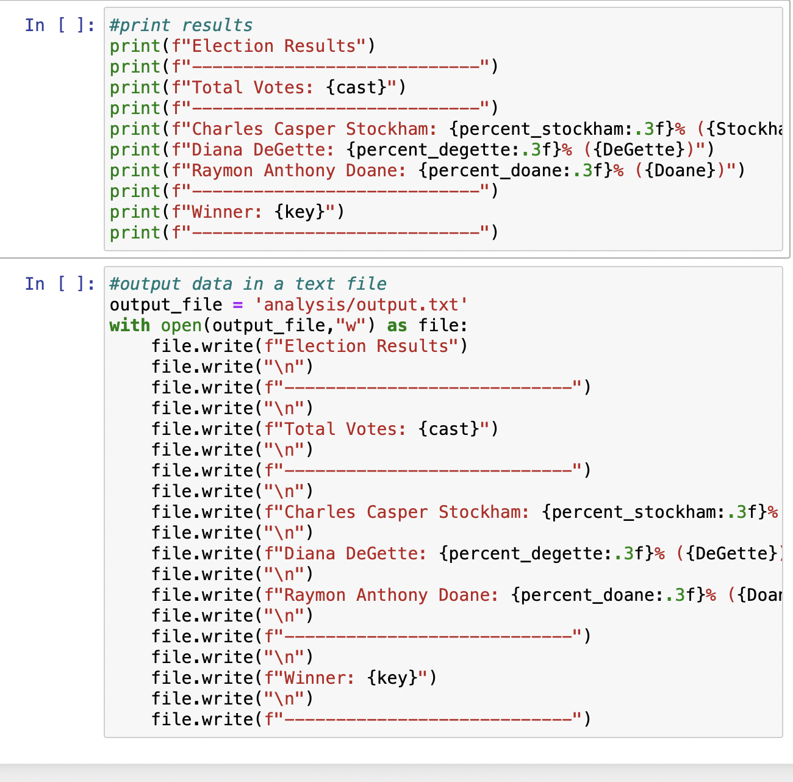

# Python-Challenge

## Overview of Project

### PyBank Instructions

Your task is to create a Python script that analyzes the records to calculate each of the following values:
    * The total number of months included in the dataset
    * The net total amount of "Profit/Losses" over the entire period
    * The changes in "Profit/Losses" over the entire period, and then the average of those changes
    * The greatest increase in profits (date and amount) over the entire period
    * The greatest decrease in profits (date and amount) over the entire period
    * In addition, your final script should both print the analysis to the terminal and export a text file with the results.

###PyPoll Instructions

You will be given a set of poll data called election_data.csv. The dataset is composed of three columns: "Voter ID", "County", and "Candidate". Your task is to create a Python script that analyzes the votes and calculates each of the following values:
    * The total number of votes cast
    * A complete list of candidates who received votes
    * The percentage of votes each candidate won
    * The total number of votes each candidate won
    * The winner of the election based on popular vote
    * In addition, your final script should both print the analysis to the terminal and export a text file with the results.

### Purpose

I am utilizing Python to analyze data from csv files in order to get more detailed information about what the data shows.

## Analysis and Challenges

### Data PyBank

### Data PyPoll

### Analysis of Outcomes Based on Goals

* During this assignment I was able to complete all the goals and objectives for the assignment. I used trouble shooting the code as I went with Jupyter Notebook and making sure I was fully understanding what each part of my code did, so when an error poped up I knew how to approach the problem.

### Challenges and Difficulties Encountered

* I think the biggest challenge for me was figuring out how to utilize the code we learned in python within pandas and jupyter notebook.

### PyBank

### PyPoll

## Results

* What are two conclusions you can draw about the data?

    * PyBank
        * Overall the changes in the price is on a negative trend, this might lead to overall problems within the finacial systems within the company.
        * The greatest decrease of the data happened in 2010, which might have lead to a decrease in profits for that year overall.

    * PyPoll
        * Diana DeGette won a significant amount (73%) of the popular votes, which led to her winning the election overall.
        * The two other candidates had 26% of the total votes combined, which shows that the public did not like those candidates as much as Diana Degette.

* What are some limitations of this dataset?

    * What was happening in the world outside of the data that could have effected the data?
    * Why did people vote for the choosen candidate?
        * What impact will that have on the community
